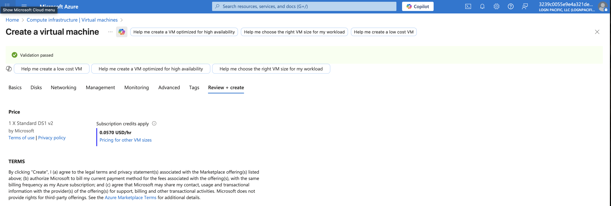
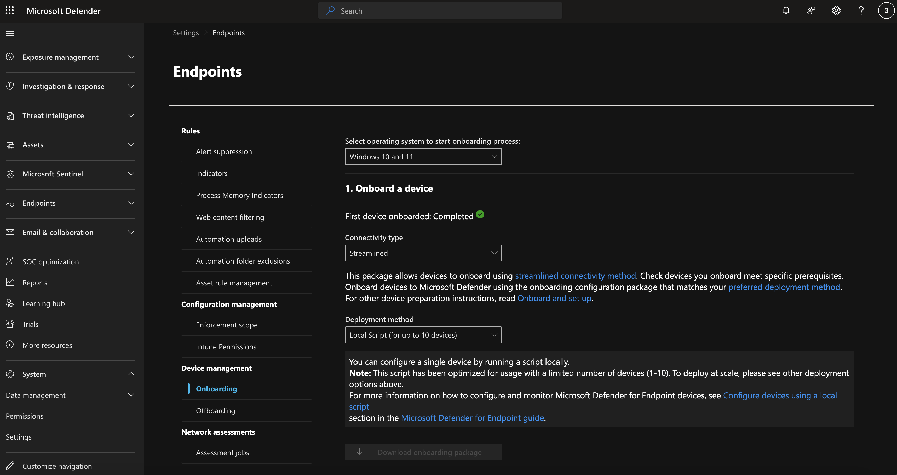
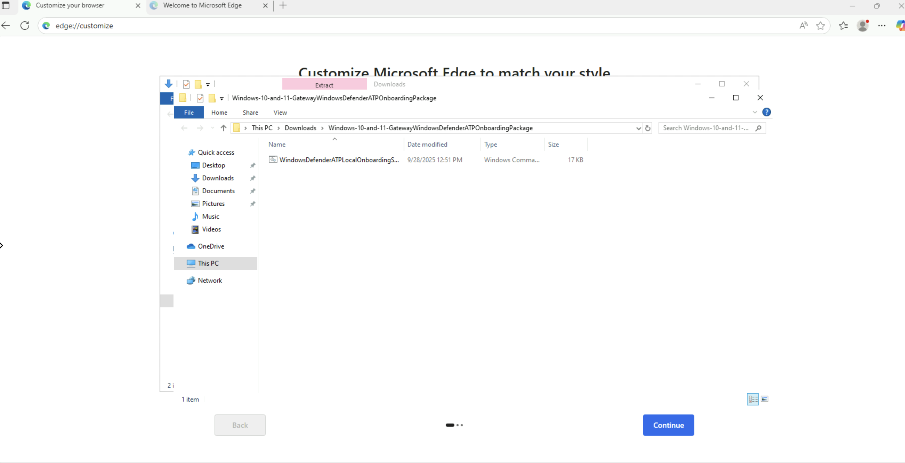
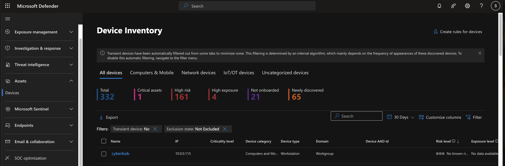
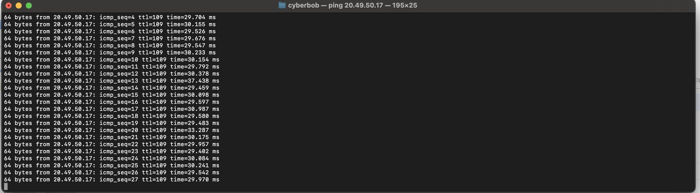
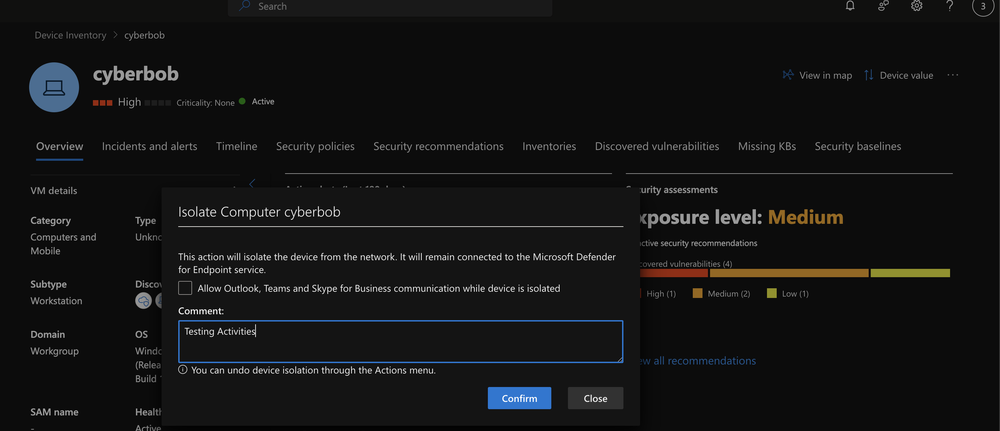
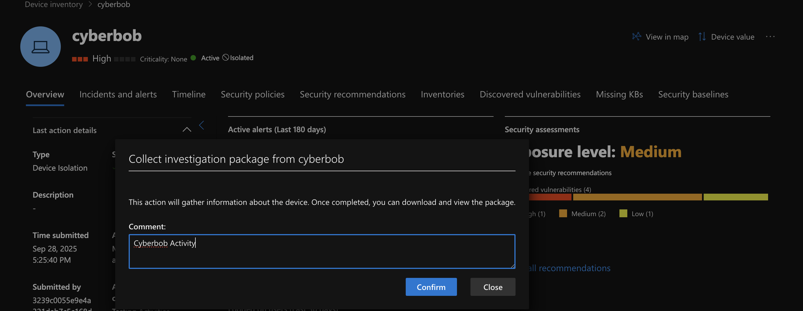
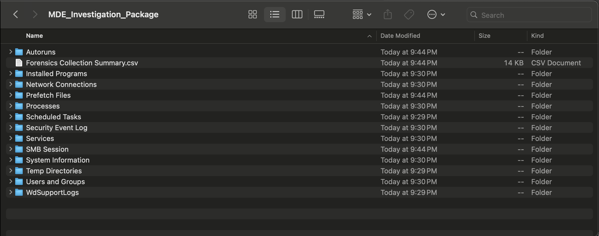

# 🛡️ Microsoft Defender for Endpoint (MDE) Onboarding & Investigation Lab

This project demonstrates how to onboard a **Windows Virtual Machine (VM)** to **Microsoft Defender for Endpoint (MDE)**, isolate it for investigation, and collect forensic data for analysis.  
The lab helps build practical SOC skills in **endpoint security**, **incident response**, and **device investigation**.

---

## 🚀 Lab Overview

This lab covers:

1. ✅ **Onboarding VM to MDE**
2. 🔒 **Isolating a Device**
3. 🧰 **Collecting an Investigation Package**

---

## 🧱 Part 1 – Onboarding VM to MDE

### 🖥️ Step 1: Create a Windows Virtual Machine
- Use **Azure Portal** to deploy a **Windows 10/11 VM**.  
- Avoid weak credentials (e.g., `labuser/Cyberlab123!`) to prevent real-world breaches.

📸 **Screenshot – Creating VM**

---

### 🧠 Step 2: Access the MDE Portal  
Navigate to: [https://security.microsoft.com](https://security.microsoft.com)

- Go to:  
  `Settings → Endpoints → Device Management → Onboarding`

📸 **Screenshot – Endpoints Onboarding Page**  

---

### 📦 Step 3: Download the Onboarding Package
- Select **Windows 10 and 11**.
- Choose **Local Script (up to 10 devices)**.
- Click **Download Onboarding Package**.

📸 **Screenshot – Downloading Onboarding Package**  

---

### ⚙️ Step 4: Run the Onboarding Script
- Log into your **VM**.
- Right-click the script → **Run as Administrator**.
- Confirm with **Y** when prompted.

📸 **Screenshot – Running Script**  

---

### 🔍 Step 5: Verify Device in MDE Portal
- Go to **Assets → Devices** in MDE.
- Confirm the VM appears in the device list.

📸 **Screenshot – Device Onboarded**  

---

## 🧱 Part 2 – Isolating the VM

### 🧰 Step 1: Prepare the VM
- Turn off **Windows Firewall** (`wf.msc`).
- Update NSG to allow **ALL inbound traffic** (especially ICMP).  
- Start a **perpetual ping** from your host machine to the VM’s **public IP**.

📸 **Screenshot – Ping Before Isolation**  

---

### 🧠 Step 2: Isolate the Device
- In **MDE Portal → Assets → Devices**, select the device.
- Click **⋯ → Isolate device**.
- Observe ping stops — confirming network isolation.

📸 **Screenshot – Isolation Action**  

---

## 🧰 Part 3 – Collecting an Investigation Package

### 🧾 Step 1: Collect Data
- In the device view, select **⋯ → Collect Investigation Package**.
- Add a comment (e.g., *Cyberbob Activity*).

📸 **Screenshot – Collecting Package**  

---

### 📁 Step 2: Review the Package
- Go to **Action Center** → download when ready.
- Extract and review contents such as:
  - **Forensics Collection Summary.csv**
  - **Network Connections**
  - **Processes**
  - **Security Event Logs**

📸 **Screenshot – Investigation Files**

---

## 🧠 Key Learnings

- ✅ How to onboard endpoints into **MDE**.
- 🔒 How to **isolate** compromised endpoints.
- 🧰 How to collect and analyze **forensic data** for threat hunting.

---

## 📎 References

- [Microsoft Defender for Endpoint Documentation](https://learn.microsoft.com/en-us/microsoft-365/security/defender-endpoint/)
- [Microsoft Security Portal](https://security.microsoft.com)
- [Azure Portal](https://portal.azure.com)

---

## 📂 Repository
🔗 GitHub: [https://github.com/CyberAllante/Visualizations](https://github.com/CyberAllante/Visualizations)
